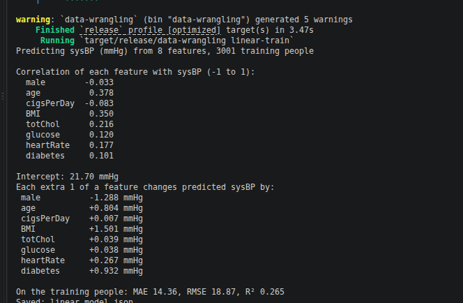
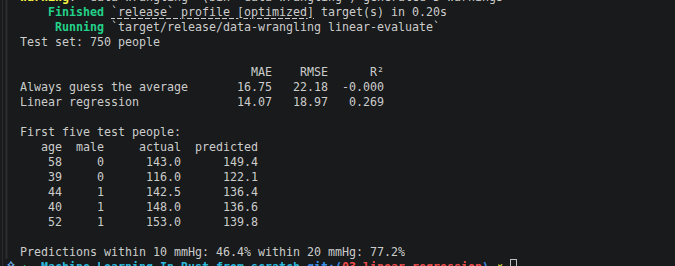

# Machine Learning in Rust from Scratch

A chapter-by-chapter machine learning project using the Framingham heart study dataset. This branch implements the linear-regression chapter and uses the cleaned data prepared in earlier steps.

## Chapter 3 — Linear regression for blood pressure

This chapter fits an ordinary least squares model to predict `sysBP` from eight patient features. The model uses the cleaned training split, prints the learned coefficients, and evaluates how well it generalises to the held-out test set.

### Train the model

```bash
cargo run --release -- linear-train
```

The training stage reads [data/framingham_train.csv](data/framingham_train.csv), computes feature correlations with `sysBP`, fits a linear regression model, prints the intercept and per-feature coefficients, and saves the trained parameters to `linear_model.json`.



### Evaluate the model

```bash
cargo run --release -- linear-evaluate
```

The evaluation stage loads the saved model, scores it on [data/framingham_test.csv](data/framingham_test.csv), compares it to the "always guess the mean" baseline, prints MAE/RMSE/R², and reports the share of predictions within 10 and 20 mmHg of the true value.



## Earlier chapters

- Chapter 1 explored the raw dataset and the target distribution: [Chapter 1 branch](https://github.com/Chatelo/Machine-Learning-In-Rust-from-scratch/tree/01-data-explore)
- Chapter 2 cleaned the data and created the train/test split: [Chapter 2 branch](https://github.com/Chatelo/Machine-Learning-In-Rust-from-scratch/tree/02-data-cleaning-split)
- This branch is Chapter 3: [03-linear-regression](https://github.com/Chatelo/Machine-Learning-In-Rust-from-scratch/tree/03-linear-regression)

## Project files

- [src/main.rs](src/main.rs) — command-line stage selector (`explore`, `clean`, `split`, `linear-train`, `linear-evaluate`)
- [src/data.rs](src/data.rs) — shared loading, cleaning, and split helpers
- [src/explore.rs](src/explore.rs) — chapter 1 raw-data exploration
- [src/linear.rs](src/linear.rs) — chapter 3 linear-regression training and evaluation
- [data/framingham_train.csv](data/framingham_train.csv) — training split
- [data/framingham_test.csv](data/framingham_test.csv) — test split

The first build may take a few minutes while Cargo compiles the required crates; later runs are faster.
