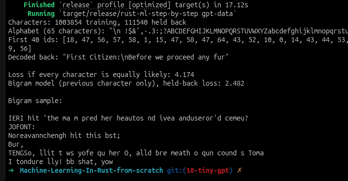
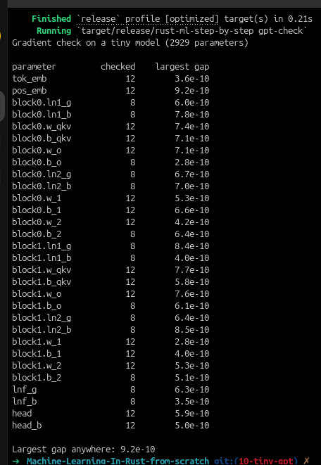
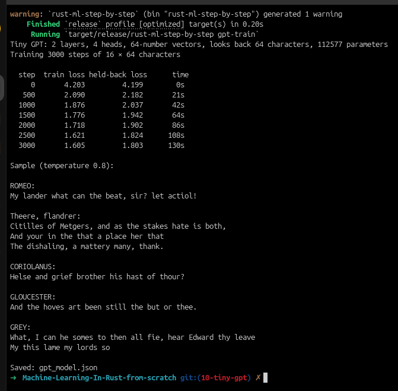
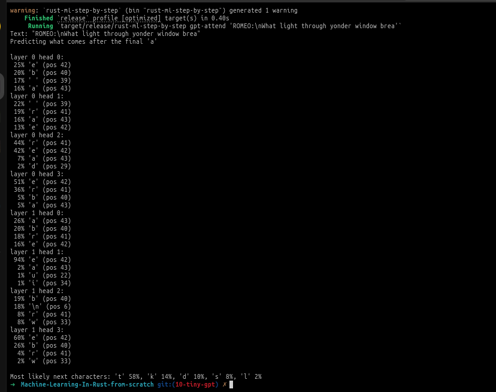

# Machine Learning in Rust from Scratch

A chapter-by-chapter machine learning project using the Framingham heart study dataset, tweet text, and Shakespeare text. This chapter implements Chapter 10: a tiny GPT written from scratch.

## Chapter 10 — A tiny GPT, written from scratch

This chapter builds a character-level transformer using the same ingredients as modern language models: token embeddings, positional embeddings, causal self-attention, MLP blocks, residual connections, and a softmax output head. It learns to predict the next character in a text stream, starting from Shakespeare.

### Inspect the dataset

```bash
cargo run --release -- gpt-data
```

This stage loads the text, builds the character vocabulary, splits the corpus into training and held-back validation data, and reports the baseline losses from a uniform guess and from a simple bigram model.



### Gradient check the backpropagation

```bash
cargo run --release -- gpt-check
```

This stage runs a numerical finite-difference check on a tiny model to verify that the hand-written backward pass matches the true gradient.



### Train the tiny GPT

```bash
cargo run --release -- gpt-train
```

This stage trains a small transformer on Shakespeare text for a fixed number of steps, prints train and validation losses over time, and then samples a little Shakespeare-like continuation from a prompt.



### Write new text

```bash
cargo run --release -- gpt-write "ROMEO:\n" 300 0.8
```

This generation stage loads the saved model, samples new characters from a prompt, and prints the resulting text at a chosen temperature.



### Inspect attention heads

```bash
cargo run --release -- gpt-attend "KING HENRY:\nWhat says the king?"
```

This optional debugging mode shows which earlier characters each attention head was focusing on when predicting the next character.

## Earlier chapters

- Chapter 1: raw-data exploration and summary statistics — [01-data-explore](https://github.com/Chatelo/Machine-Learning-In-Rust-from-scratch/tree/01-data-explore)
- Chapter 2: cleaning and stratified train/test split — [02-data-cleaning-split](https://github.com/Chatelo/Machine-Learning-In-Rust-from-scratch/tree/02-data-cleaning-split)
- Chapter 3: linear regression for `sysBP` — [03-linear-regression](https://github.com/Chatelo/Machine-Learning-In-Rust-from-scratch/tree/03-linear-regression)
- Chapter 4: logistic regression, tuning, and HTTP prediction — [04-logistic-regression-for-classification](https://github.com/Chatelo/Machine-Learning-In-Rust-from-scratch/tree/04-logistic-regression-for-classification)
- Chapter 5: decision tree, tuning, and explainable prediction — [05-decision-trees](https://github.com/Chatelo/Machine-Learning-In-Rust-from-scratch/tree/05-decision-trees)
- Chapter 6: random forest, OOB tuning, and POST /predict/forest — [06-random-forest](https://github.com/Chatelo/Machine-Learning-In-Rust-from-scratch/tree/06-random-forest)
- Chapter 7: text preprocessing, SVMs, and tweet sentiment — [07-text-svm](https://github.com/Chatelo/Machine-Learning-In-Rust-from-scratch/tree/07-text-svm)
- Chapter 8: Naive Bayes and k-nearest neighbours — [08-naive-bayes-knn](https://github.com/Chatelo/Machine-Learning-In-Rust-from-scratch/tree/08-naive-bayes-knn)
- Chapter 9: neural networks — [09-neural-networks](https://github.com/Chatelo/Machine-Learning-In-Rust-from-scratch/tree/09-neural-networks)
- Current chapter: Chapter 10 — tiny GPT

## Project files

- [src/main.rs](src/main.rs) — stage selector for the chapter commands, including `gpt-data`, `gpt-check`, `gpt-train`, `gpt-write`, and `gpt-attend`
- [src/gpt.rs](src/gpt.rs) — tokenizer, transformer blocks, training loop, generation, and attention inspection
- [src/data.rs](src/data.rs) — shared loading and helpers for the book datasets
- [src/text.rs](src/text.rs) — tokenization helpers for the text datasets
- [data/shakespeare.txt](data/shakespeare.txt) — training text for the character-level transformer

The first build may take a few minutes while Cargo compiles dependencies; later runs are much faster.
