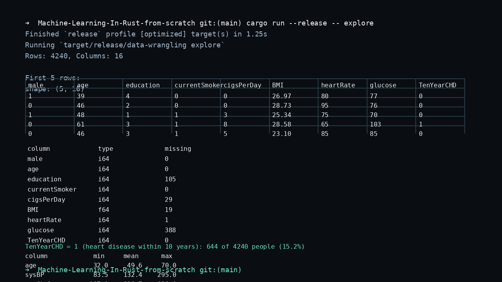

# Machine Learning in Rust from Scratch

This project follows a chapter-by-chapter workflow for learning machine learning in Rust, starting with raw data and building up toward model training and evaluation.

## Chapter 1 — A first look at the data

The first chapter loads the Framingham heart study dataset and answers a few foundational questions:

- How large is the table?
- What columns does it contain?
- Which values are missing?
- What is the distribution of the target outcome?

The exploratory code lives in [src/explore.rs](src/explore.rs) and reads the CSV from [data/framingham.csv](data/framingham.csv). It prints the first few rows, summarises each column type and missing values, counts the `TenYearCHD` event rate, and reports basic summary statistics for the main numeric features.

### Run the chapter

```bash
cargo run --release -- explore
```

This executes the chapter 1 data exploration stage and prints the dataset summary in the terminal.

### Example output



### What the output tells us

- The dataset contains 4,240 rows and 16 columns.
- Several columns have missing values, including `education`, `cigsPerDay`, `BMI`, and `glucose`.
- The `TenYearCHD` target is imbalanced: roughly 15.2% of patients were diagnosed with heart disease within 10 years.
- Key summarised variables include age, systolic blood pressure, total cholesterol, BMI, smoking exposure, and glucose.

### Notes

- The first build may take a few minutes because Cargo downloads and compiles Polars.
- Subsequent runs are much faster.
- The focus of this chapter is understanding the dataset, not fitting any model yet.

---

## Project structure

- [src/main.rs](src/main.rs) — entry point and chapter selector
- [src/explore.rs](src/explore.rs) — chapter 1 exploratory analysis
- [data/framingham.csv](data/framingham.csv) — raw input dataset
- [assets/chapter1.png](assets/chapter1.png) — screenshot for chapter 1 output
