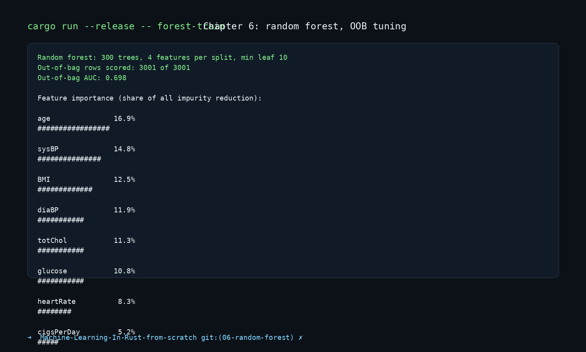

# Machine Learning in Rust from Scratch

A chapter-by-chapter machine learning project using the Framingham heart study dataset. This branch implements Chapter 6: a random forest with out-of-bag tuning and a forest prediction API.

## Chapter 6 — Random forest, OOB tuning, and POST /predict/forest

This chapter builds a random forest that predicts whether a person is likely to develop heart disease. Each tree is trained on a bootstrap sample, each split picks from a random subset of features, and the forest answer is the average probability across all trees. The model also tracks out-of-bag predictions so it can estimate performance without a separate validation set.

### Train the forest

```bash
cargo run --release -- forest-train
```

The training stage reads [data/framingham_train.csv](data/framingham_train.csv), grows a 300-tree forest, scores every out-of-bag row, prints the feature-importance ranking, and saves the model to `forest_model.json`.

### Tune the forest

```bash
cargo run --release -- forest-tune
```

This runs a grid search over feature counts and minimum leaf sizes, reports out-of-bag AUC for several candidate forests, and chooses the best threshold by F1 score before saving the tuned model.

### Evaluate the forest

```bash
cargo run --release -- forest-evaluate
```

The evaluation stage loads the saved forest, scores it on [data/framingham_test.csv](data/framingham_test.csv), and prints AUC plus classification metrics at the chosen threshold.

### Serve the prediction API

```bash
cargo run --release -- serve
```

The HTTP server exposes:

- `POST /predict` for the logistic model
- `POST /predict/tree` for the decision tree
- `POST /predict/forest` for the random forest

The forest endpoint returns the probability and the share of trees that agree with the final at-risk decision.

### Example output



## Earlier chapters

- Chapter 1: raw-data exploration and summary statistics — [01-data-explore](https://github.com/Chatelo/Machine-Learning-In-Rust-from-scratch/tree/01-data-explore)
- Chapter 2: cleaning and stratified train/test split — [02-data-cleaning-split](https://github.com/Chatelo/Machine-Learning-In-Rust-from-scratch/tree/02-data-cleaning-split)
- Chapter 3: linear regression for `sysBP` — [03-linear-regression](https://github.com/Chatelo/Machine-Learning-In-Rust-from-scratch/tree/03-linear-regression)
- Chapter 4: logistic regression, tuning, and HTTP prediction — [04-logistic-regression-for-classification](https://github.com/Chatelo/Machine-Learning-In-Rust-from-scratch/tree/04-logistic-regression-for-classification)
- Chapter 5: decision tree, tuning, and explainable prediction — [05-decision-trees](https://github.com/Chatelo/Machine-Learning-In-Rust-from-scratch/tree/05-decision-trees)
- Current branch: Chapter 6 — [06-random-forest](https://github.com/Chatelo/Machine-Learning-In-Rust-from-scratch/tree/06-random-forest)

## Project files

- [src/main.rs](src/main.rs) — stage selector for `explore`, `clean`, `split`, `linear-train`, `linear-evaluate`, `train`, `evaluate`, `tune`, `serve`, `tree-train`, `tree-evaluate`, `tree-tune`, `forest-train`, `forest-evaluate`, and `forest-tune`
- [src/data.rs](src/data.rs) — shared loading, cleaning, splitting, and cross-validation helpers
- [src/explore.rs](src/explore.rs) — chapter 1 exploration
- [src/linear.rs](src/linear.rs) — chapter 3 linear-regression workflow
- [src/logistic.rs](src/logistic.rs) — chapter 4 logistic-regression workflow
- [src/tree.rs](src/tree.rs) — chapter 5 decision-tree training, evaluation, tuning, and explanation logic
- [src/forest.rs](src/forest.rs) — chapter 6 random-forest training, OOB evaluation, tuning, and forest prediction logic
- [src/server.rs](src/server.rs) — HTTP prediction endpoints for the logistic, tree, and forest models
- [data/framingham_train.csv](data/framingham_train.csv) — training split
- [data/framingham_test.csv](data/framingham_test.csv) — test split

The first build may take a few minutes while Cargo compiles dependencies; later runs are much faster.
