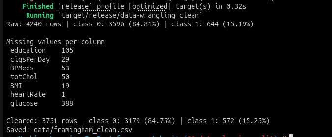
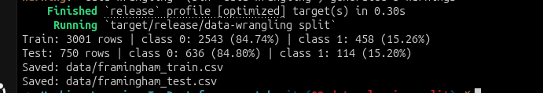

# Machine Learning in Rust from Scratch

A chapter-by-chapter machine learning project using the Framingham heart study dataset. The current chapter prepares the data for modeling; no model is trained yet.

## Chapter 2 — Clean and split the data

Starting from the raw dataset, this chapter removes unusable data and creates reproducible training and test sets. The target is `TenYearCHD`.

### 1. Clean

```bash
cargo run --release -- clean
```

The cleaning stage reports the original class balance, drops the non-health `education` column, removes rows with any remaining missing values, reports the resulting balance, and writes [data/framingham_clean.csv](data/framingham_clean.csv).



### 2. Split

Run this after cleaning:

```bash
cargo run --release -- split
```

The split stage uses seed `42` to shuffle each target class separately, assigns 20% of each class to the test set, then shuffles each resulting set. This preserves the target-class proportions in both sets. It prints each split's class balance and writes [data/framingham_train.csv](data/framingham_train.csv) and [data/framingham_test.csv](data/framingham_test.csv).



The code also includes a five-fold assignment helper for training data, but cross-validation and model training are not wired into a runnable stage yet.

## Previous chapter

Chapter 1 explored the raw CSV: its dimensions and columns, missing values, target balance, and summary statistics for selected numeric features. See the [Chapter 1 branch](https://github.com/Chatelo/Machine-Learning-In-Rust-from-scratch/tree/01-data-explore), or run it with `cargo run --release -- explore`. Its output screenshot is [assets/chapter1.png](assets/chapter1.png).

## Project files

- [src/main.rs](src/main.rs) — command-line stage selector (`explore`, `clean`, `split`)
- [src/explore.rs](src/explore.rs) — raw-data exploration
- [src/data.rs](src/data.rs) — cleaning, splitting, shared data helpers, and fold assignment
- [data/framingham.csv](data/framingham.csv) — raw input dataset

The first build may take a few minutes while Cargo compiles Polars; later runs are faster.
