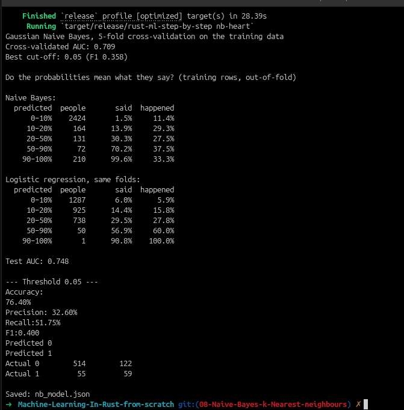
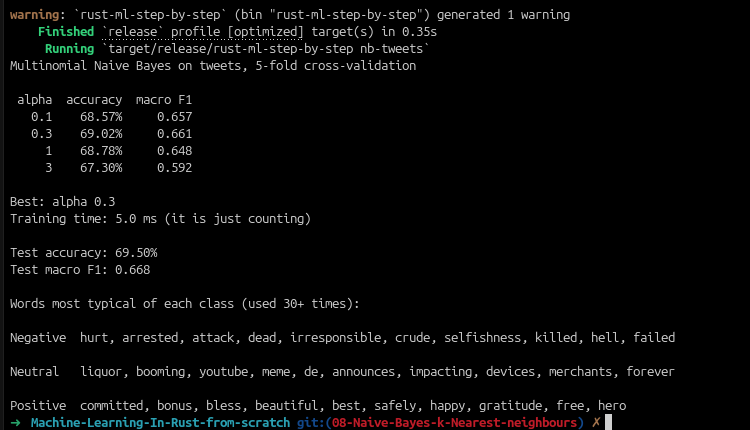
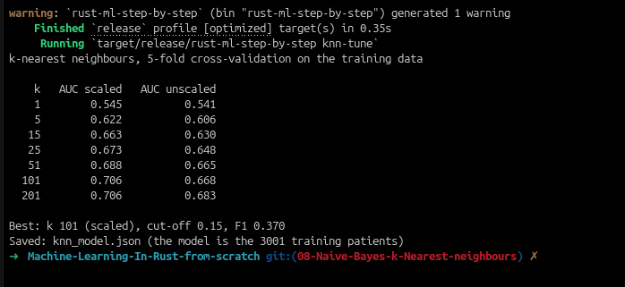

# Machine Learning in Rust from Scratch

A chapter-by-chapter machine learning project using the Framingham heart study dataset and a tweet sentiment dataset. This chapter implements Chapter 8: Naive Bayes and k-nearest neighbours.

## Chapter 8 — Naive Bayes and k-nearest neighbours

This chapter adds two different ways to classify patients and tweet sentiment without needing a deep neural network.

- Gaussian Naive Bayes models the heart-disease features as bell curves and estimates the probability that a patient belongs to each class.
- Multinomial Naive Bayes counts word occurrences in tweets and uses the word frequencies to estimate sentiment probabilities.
- k-nearest neighbours keeps the training rows and classifies a new patient by the majority label among the most similar cases.

### Gaussian Naive Bayes on the heart data

```bash
cargo run --release -- nb-heart
```

This stage fits a Naive Bayes model on the Framingham training data, evaluates it with out-of-fold validation, checks calibration, and saves the final model to `nb_model.json`.



### Multinomial Naive Bayes on the tweets

```bash
cargo run --release -- nb-tweets
```

This stage trains a word-count Naive Bayes classifier over the tweet dataset, compares a few smoothing strengths, and reports accuracy and macro-F1 on the held-out test set.



### k-nearest neighbours on the heart data

```bash
cargo run --release -- knn-tune
```

This stage tries several values of `k`, compares scaled and unscaled distance models, chooses the best threshold by F1, and saves the final model to `knn_model.json`.

```bash
cargo run --release -- knn-evaluate
```

The evaluation stage loads the saved k-NN model, scores it on the test set, and prints AUC and classification metrics.



## Earlier chapters

- Chapter 1: raw-data exploration and summary statistics — [01-data-explore](https://github.com/Chatelo/Machine-Learning-In-Rust-from-scratch/tree/01-data-explore)
- Chapter 2: cleaning and stratified train/test split — [02-data-cleaning-split](https://github.com/Chatelo/Machine-Learning-In-Rust-from-scratch/tree/02-data-cleaning-split)
- Chapter 3: linear regression for `sysBP` — [03-linear-regression](https://github.com/Chatelo/Machine-Learning-In-Rust-from-scratch/tree/03-linear-regression)
- Chapter 4: logistic regression, tuning, and HTTP prediction — [04-logistic-regression-for-classification](https://github.com/Chatelo/Machine-Learning-In-Rust-from-scratch/tree/04-logistic-regression-for-classification)
- Chapter 5: decision tree, tuning, and explainable prediction — [05-decision-trees](https://github.com/Chatelo/Machine-Learning-In-Rust-from-scratch/tree/05-decision-trees)
- Chapter 6: random forest, OOB tuning, and POST /predict/forest — [06-random-forest](https://github.com/Chatelo/Machine-Learning-In-Rust-from-scratch/tree/06-random-forest)
- Chapter 7: text preprocessing, SVMs, and tweet sentiment — [07-text-svm](https://github.com/Chatelo/Machine-Learning-In-Rust-from-scratch/tree/07-text-svm)
- Current chapter: Chapter 8 — Naive Bayes and k-NN

## Project files

- [src/main.rs](src/main.rs) — stage selector for the chapter commands, including `nb-heart`, `nb-tweets`, `knn-tune`, and `knn-evaluate`
- [src/bayes.rs](src/bayes.rs) — Gaussian and multinomial Naive Bayes implementations
- [src/knn.rs](src/knn.rs) — k-nearest neighbours tuning and evaluation
- [src/text.rs](src/text.rs) — vocabulary and tweet preprocessing
- [src/data.rs](src/data.rs) — shared loading, cleaning, splitting, and cross-validation helpers
- [src/metrics.rs](src/metrics.rs) — performance metrics and threshold tuning
- [data/framingham_train.csv](data/framingham_train.csv) — heart-data training split
- [data/framingham_test.csv](data/framingham_test.csv) — heart-data test split
- [data/tweets_train.csv](data/tweets_train.csv) — tweet training data
- [data/tweets_test.csv](data/tweets_test.csv) — tweet test data

The first build may take a few minutes while Cargo compiles dependencies; later runs are much faster.
